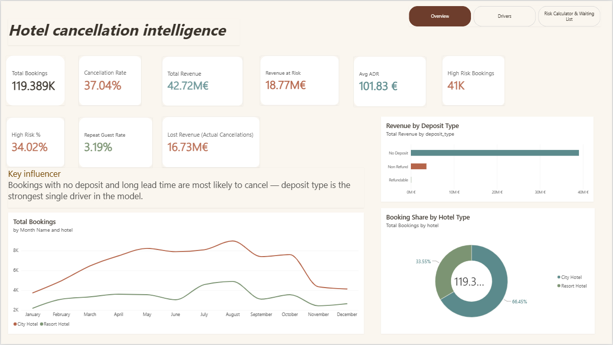
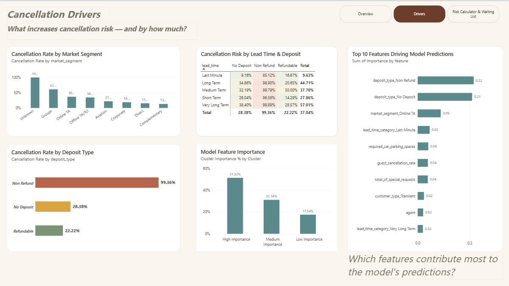
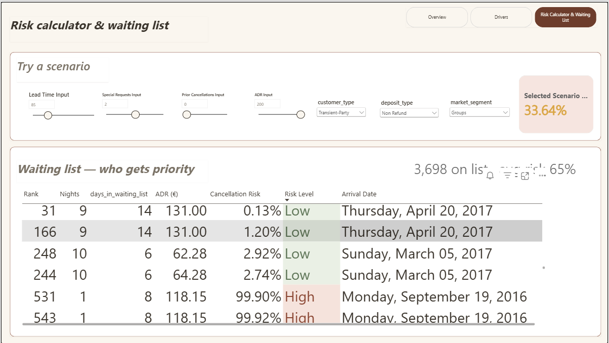
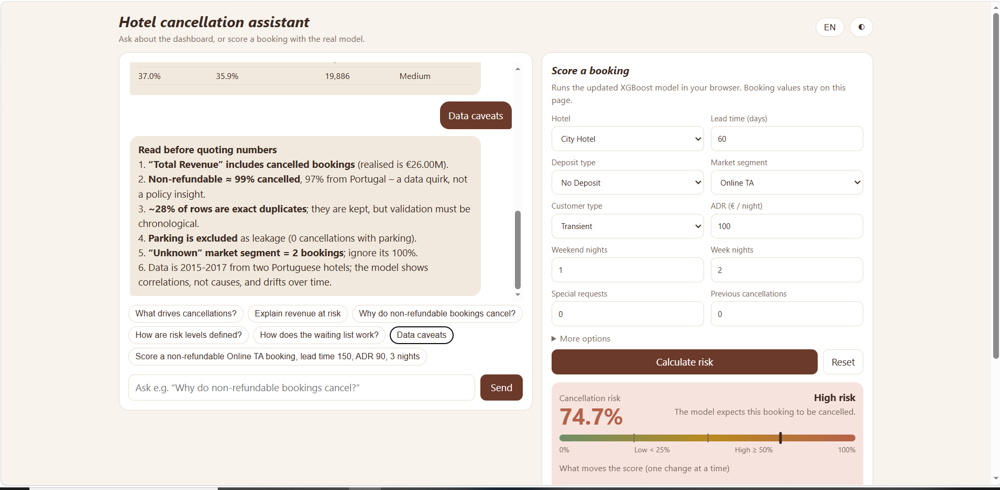
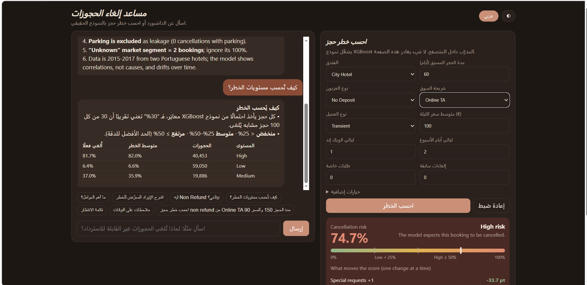

# CancelIQ — Hotel Booking Cancellation Intelligence Platform

*Predictive analytics · revenue-at-risk modeling · explainable AI · BI dashboard · AI copilot*

Project report — Data Mining & Visualization, MTC Digilians Program
Author: **Nada Mohamed Khalil**

CancelIQ analyses 119,389 cleaned historical hotel bookings, predicts cancellation risk with a calibrated XGBoost model, estimates the financial exposure behind that risk, and makes the results usable through a Power BI dashboard and a bilingual (Arabic/English) browser assistant. An optional local data API supports free‑form questions, with Gemini available when a server‑side key is configured.

---

## Table of contents

1. [Business problem](#1-business-problem)
2. [Data understanding & cleaning](#2-data-understanding--cleaning)
3. [Feature engineering](#3-feature-engineering)
4. [EDA & statistical validation](#4-eda--statistical-validation)
5. [Machine learning](#5-machine-learning)
6. [Benchmark against a reference project](#6-benchmark-against-a-reference-project)
7. [Power BI dashboard](#7-power-bi-dashboard)
8. [Chatbot](#8-chatbot)
9. [Repository structure](#9-repository-structure)
10. [Running it locally](#10-running-it-locally)
11. [Caveats — read before quoting numbers](#11-caveats--read-before-quoting-numbers)
12. [Conclusion](#12-conclusion)

---

## 1. Business problem

The hotel needed answers to six practical questions:

- Which bookings are likely to be cancelled?
- How much revenue is at risk from those cancellations?
- What factors actually drive cancellation behaviour?
- Which specific bookings or customers need proactive attention?
- What operational patterns can the hotel improve?
- How can historical booking data support better day‑to‑day decisions?

## 2. Data understanding & cleaning

The raw dataset (36 columns, 119,390 rows) was cleaned deliberately rather than with a blanket `dropna()`. Missingness itself was treated as signal where relevant, and every decision was justified against the business context.

| Issue | Finding | Decision |
|---|---|---|
| `company` missing | 94.31% missing | Recoded as "No Company" — 38.22% cancel rate when missing vs 17.52% when present |
| `agent` missing | 13.69% missing | Recoded as "No Agent" — 24.66% vs 39.00% cancel rate |
| `country` missing | 0.41% missing | Recoded as "Unknown" |
| `children` missing | 4 rows | Filled with 0, based on booking context, not asserted as certain |
| Duplicates | 0 exact duplicates | None removed |
| Undefined categories | `meal`, `market_segment`, `distribution_channel` | Standardized to "Unknown" |
| Negative ADR | 1 row (adr = ‑6.38) | Removed as invalid |
| Extreme ADR | max 5,400 | Kept — no evidence of entry error |
| Zero‑night bookings | 715 rows | Kept — legitimate for cancellations/no‑shows |
| Outliers | thousands flagged by IQR | Investigated individually, not auto‑removed |
| PII (name, email, phone, card) | present | Dropped entirely from the analytical dataset |
| Leakage (`reservation_status`, date) | near‑perfect mapping to target | Dropped — post‑outcome information |

## 3. Feature engineering

New features were built with business meaning, not just statistical convenience: `total_guests`, `total_nights`, `estimated_revenue` (ADR × nights), `party_size_category`, `stay_type`, `lead_time_category`, `has_booking_changes`, `has_previous_cancellation`, `has_special_requests`, `requires_parking`, `room_type_changed` — plus, at the modeling stage, `guest_cancellation_rate`, `adr_per_person`, and cyclical (sin/cos) encoding of arrival month.

A correlation heatmap caught redundant feature pairs that one‑at‑a‑time testing had missed:

- `requires_parking` ↔ `required_car_parking_spaces` (r = 0.99)
- `has_special_requests` ↔ `total_of_special_requests` (r = 0.86)
- `has_booking_changes` ↔ `booking_changes` (r = 0.80)

The final analytical dataset held 44 columns, trimmed to 38 features for modeling after removing IDs, dates, and redundant pairs.

## 4. EDA & statistical validation

Every visual finding was backed by a formal test — Chi‑square with Cramér's V for categorical associations, Mann‑Whitney U for numeric comparisons — so no claim rests on a bar chart alone. All findings are reported as **association, not causation**.

| Variable | Cancellation‑rate spread | Effect size | Verdict |
|---|---|---|---|
| Deposit type | No Deposit 28.4% · Non‑Refund 99.4% · Refundable 22.2% | V = 0.4815 (strong) | Top priority |
| Previous cancellations | 33.9% → 91.6% | V = 0.2709 (moderate) | High priority |
| Market segment | Groups 61.1% · Online TA 36.7% · Direct 15.3% | V = 0.2668 (moderate) | High priority |
| Lead time | median 45d (kept) vs 113d (cancelled) | 0.3785 | High priority |
| Hotel type | City 41.7% vs Resort 27.8% | V = 0.1365 (weak) | Kept, not standalone |
| Customer type | Transient 40.8% vs Group 10.2% | V = 0.1364 (weak) | Kept, low priority |
| ADR | median 92.5 vs 96.2 | 0.0608 (very small) | Kept, low priority |

## 5. Machine learning

The train/test split was **chronological** (80/20), not random, because bookings have a real time order that a random split would ignore.

- Train: Jul 2015 – Mar 2017 (35.85% cancel rate)
- Test: Mar – Aug 2017 (40.79% cancel rate)

**Preprocessing:** numeric features median‑imputed and standardized; low‑cardinality categoricals one‑hot encoded; high‑cardinality fields (`agent`, `company`, `country`) frequency‑encoded to avoid an exploding, overfit‑prone feature space. All transforms fit on train only.

Six model families were trained and tuned under the exact same evaluation regime — a small random hyper‑parameter search, every candidate scored on pooled out‑of‑time predictions from four expanding‑window temporal folds (Apr 2016 → Mar 2017), so no model gets an easier validation scheme than another.

**Temporal cross‑validation (train set):**

| Model | Accuracy | Precision | Recall | F1 | ROC‑AUC | PR‑AUC |
|---|---|---|---|---|---|---|
| Dummy baseline | 63.63% | 0.00 | 0.00 | 0.00 | 0.482 | 0.353 |
| Logistic Regression (tuned) | 80.05% | 72.41% | 72.94% | 72.67% | 0.869 | 0.818 |
| LightGBM (tuned) | 82.62% | 77.95% | 72.82% | 75.30% | 0.898 | 0.858 |
| Random Forest (tuned) | 82.89% | 78.09% | 73.63% | 75.79% | 0.896 | 0.853 |
| CatBoost (tuned) | 82.94% | 79.50% | 71.56% | 75.32% | 0.901 | 0.861 |
| Blend (XGBoost + LightGBM) | 83.05% | 80.27% | 70.81% | 75.25% | 0.904 | 0.863 |
| **XGBoost (tuned) — winner** | **83.05%** | **80.44%** | **70.56%** | **75.18%** | **0.904** | **0.863** |

XGBoost was selected **programmatically** — not hard‑coded — as the model with the best temporal‑CV accuracy, statistically tied with the Blend. It was then calibrated (Platt scaling) and evaluated **once**, untouched, on the held‑out future test window:

**One‑time holdout test (Mar – Aug 2017, unseen):**

| Metric | Score |
|---|---|
| Accuracy | 79.49% |
| Precision | 76.54% |
| Recall | 71.70% |
| F1 | 74.04% |
| ROC‑AUC | 0.885 |
| PR‑AUC | 0.846 |

The gap between the 83.05% temporal‑CV accuracy and the 79.49% test accuracy is expected and reported honestly: the test window has a meaningfully higher actual cancellation rate (40.8% vs 35.9% in training), which is ordinary drift when forecasting forward in time, not a bug. **This test‑set figure — not the higher cross‑validation numbers — is the one to quote publicly.**

## 6. Benchmark against a reference project

Before building this pipeline, a reference project was used to calibrate expectations for scope and quality: a fellow capstone team's "Hotel Intelligence" dashboard (Snipers Team), covering the same brief on the same booking dataset. Its published result was a Random Forest classifier reaching 81% accuracy, F1 of 0.79, and AUC of 0.86.

| Metric | Reference project (Random Forest) | This project — Random Forest (tuned) | This project — Logistic Regression (tuned) |
|---|---|---|---|
| Accuracy | 81.0% | 82.89% | 80.05% |
| ROC‑AUC | 0.860 | 0.896 | 0.869 |
| F1‑score | 0.79 | 0.758 | 0.727 |

These comparisons are **informal** — the reference project did not use the same train/test split or evaluation protocol. For this project's final, later‑in‑time test, the selected XGBoost achieved 79.49% accuracy and 0.885 ROC‑AUC. The reference result set an informal benchmark; the strongest evidence for the model is the one‑time chronological holdout test above, reported with precision, recall and F1 alongside accuracy.

## 7. Power BI dashboard

Three pages sit on top of the model's outputs.

### Overview


KPIs, revenue by deposit type, booking share by hotel type — 119,389 cleaned bookings, 37.04% cancelled, €42.72M gross booked value (including cancelled bookings), €16.73M estimated value of cancelled bookings, €16.81M model‑expected exposure, €101.83 average ADR, and 40,453 high‑risk bookings at the 50% risk threshold.

### Cancellation drivers


Segment/deposit breakdowns next to the model's top feature importances. The updated SHAP feature summary ranks guest country, deposit type, agent, total special requests, lead time and market segment among the leading signals. Feature importance measures contribution to predictions; it does **not** establish a causal effect or, by itself, the direction of an effect.

### Risk calculator & waiting list


A slider‑driven scenario tool for testing hypothetical bookings, paired with a waiting list ranked by expected realised value = (1 − predicted cancellation risk) × ADR × nights. It demonstrates prioritisation logic, not a live queue.

## 8. Chatbot

The bilingual assistant uses updated facts from the 119,389‑row scored booking file and the new model metadata. Its offline answers cover selected dashboard questions; its browser‑based calculator evaluates the embedded XGBoost trees and displays risk plus one‑variable what‑if changes. When the supplied local Python API is running, a Data API mode offers free‑form questions grounded in aggregates calculated from `bookings_scored.csv`. Gemini can optionally help interpret and phrase those answers when `GEMINI_API_KEY` is configured on the server; the model itself continues to calculate booking risk.

### English interface


### Arabic interface


The same assistant mirrors itself in Arabic — right‑to‑left layout included — with the same risk table, the same caveats, and the same calculator underneath.

Answers are limited by the historical data and available fields. The assistant presents probabilities and estimated exposure for decision support; **the hotel remains responsible for any operational action**. The Gemini connection requires a valid API key and has not been verified with a live key for this report.

## 9. Repository structure

```
CancelIQ/
├── data/
│   ├── hotel_bookings_final.csv        # Cleaned historical dataset — 119,389 rows
│   ├── bookings_scored.csv             # Every booking with risk score, class & estimated exposure
│   └── waiting_list_priority.csv       # Historical waiting-list bookings, ranked by expected realised value
├── model/
│   ├── best_model.json / best_model.joblib
│   ├── preprocessor.joblib             # Fitted preprocessing (needs hotel_utils.py + compatible scikit-learn)
│   ├── best_model_metadata.json        # Selected threshold, calibration & temporal test metrics
│   ├── feature_importance.csv          # Model signals — not causation or direction of effect
│   └── score_bookings.py               # Batch scoring: python score_bookings.py input.csv output.csv
├── dashboard/
│   └── dashboard_kpis.json             # Totals and risk counts backing the Power BI dashboard
├── chatbot/
│   ├── hotel_chatbot.html              # Standalone bilingual assistant (embedded model + facts)
│   └── chatbot_updated_bundle.zip      # Interface + historical data + local Python API (app.py)
├── notebook/
│   └── prediction-hotelbookingcancel.ipynb
├── screenshots/
│   ├── 01_dashboard_overview.png
│   ├── 02_cancellation_drivers.png
│   ├── 03_risk_calculator_waiting_list.png
│   ├── 04_chatbot_assistant_en.png
│   └── 05_chatbot_assistant_ar.png
└── README.md
```

## 10. Running it locally

**Standalone chatbot (no server):**
Open `chatbot/hotel_chatbot.html` directly in a browser for the built‑in dashboard answers and the client‑side booking risk calculator. High‑risk threshold: **50%**.

**Chatbot with the local data API:**

```bash
unzip chatbot_updated_bundle.zip
cd chatbot_updated_bundle
pip install pandas
python app.py
# then open http://127.0.0.1:8000
```

The Data API answers questions using aggregates computed from `bookings_scored.csv`. Optionally set `GEMINI_API_KEY` on the server for Gemini to help interpret questions and phrase responses — **never put the key in browser HTML or a public repository.** Without it, basic API summaries and comparisons still work.

Endpoints: `GET /api/health` · `GET /api/metrics` · `POST /api/chat`

The historical CSV loads at server start — restart the server after replacing it. The HTML's embedded model/facts require regeneration if the model or data change.

**Batch scoring:**

```bash
python model/score_bookings.py input.csv output.csv
```

## 11. Caveats — read before quoting numbers

- **Test vs. cross‑validation.** The reported 79.49% accuracy, 71.70% recall, 74.04% F1 and 0.885 ROC‑AUC come from a later‑in‑time holdout test. The Random Forest and Logistic Regression figures in Section 6 are training‑only temporal cross‑validation and shouldn't be presented as final test results.
- **External comparison.** The reference project's 81% accuracy and 0.860 AUC were measured on a different split — informal calibration, not a controlled head‑to‑head.
- **Financial exposure is an estimate.** Revenue‑at‑risk figures are ADR × nights, not an audited loss figure.
- **Correlation, not causation.** Feature importance and Cramér's V/Mann‑Whitney results describe association, never a causal mechanism.
- **Data quirks, not policy insight.** Non‑refundable bookings are ~99% cancelled and largely tied to one country in this dataset — an artifact of the data, not a general rule about non‑refundable rates. The "Unknown" market segment covers only 2 bookings; its 100% rate should be ignored. Parking‑related bookings are excluded as leakage (zero cancellations with parking recorded).
- **Scope.** The data covers arrivals from 2015–2017 with no live hotel feed connected. The model shows correlations from that period, which can drift over time — as already seen between the training and test windows.

Source of figures: `best_model_metadata.json`, `dashboard_kpis.json` and `bookings_scored.csv` in this project package.

## 12. Conclusion

CancelIQ brings together data cleaning, leakage checks, feature engineering, statistical analysis, temporal model validation, a Power BI dashboard and a bilingual assistant. The reported test performance is **79.49% accuracy and 0.885 ROC‑AUC**; the assistant provides updated, data‑grounded summaries and browser‑based risk scenarios, with optional Gemini wording through the local API. Historical data and informal external benchmarking remain important limits on operational claims.

---

*Project by **Nada Mohamed Khalil** — Data Mining & Visualization, MTC Digilians Program.*
